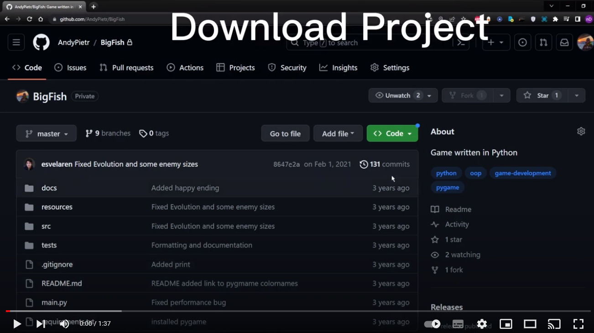

# Big Fish, what is that?
Game created in python, where you have to eat smaller fishes to grow and survive.


# How do I run this project?
1. Clone (or download) this repository
2. Change directory into unpacked Bigfish folder.
3. Prerequisites
    1. Install python 3.8+
    2. Create and activate virtual environment (optional)
    ```python
    python -venv bigfish-venv
    ```
    ```
    ./bigfish-venv/activate_script_depending_on_platform
    ```
    3. Install required modules
    ```python
    pip install -r requirements.txt
    ```
4. Run game
```python
pip -m main
```

## Video tutorial
[](https://youtu.be/Skv75mWkEvI)
[Click to play](https://youtu.be/Skv75mWkEvI)


## How to play?
- You start as a small fish, you need to avoid bigger ones.
- You can grow by eating smaller fishes.
- When you outgrow certain type of fish you can add them to your menu.

You control your character with arrows on your keyboard (<-, ->). 


# Developer note
There is inbuild debug mode helping visualize bounding boxes around difrent types of enemies. Press F12 in the main menu to enter. Press up and down keys to see relation of your size to your points. Press Enter to exit to main menu.

